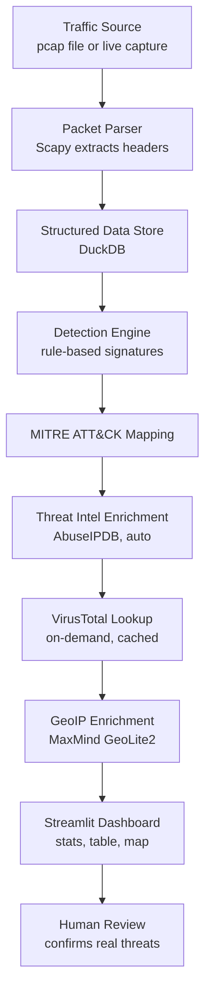

# 🛡️ Network Traffic Intrusion Detection Pipeline

A hybrid, rule-based network intrusion detection system that parses raw traffic, detects known attack patterns, maps them to MITRE ATT&CK techniques, enriches them with real-world threat intelligence, and presents everything through an interactive Streamlit dashboard.

> 🚧 **Status: Actively in development.** Core detection pipeline and dashboard are functional; ML anomaly detection and additional enrichment features are in progress. See [Roadmap](#-roadmap) below.

---

## 📖 Overview

Manually inspecting network traffic for threats doesn't scale. This project automates that process end-to-end:

**Traffic in → Parsed → Detected → Classified (MITRE ATT&CK) → Enriched (threat intel + GeoIP) → Displayed on a dashboard → Reviewed by a human.**

It's built as a learning and portfolio project demonstrating the full intrusion detection lifecycle used in real Security Operations Centers, at a scale achievable on a single machine.

---

## ✨ Features

- **Flexible input** — analyze pre-recorded `.pcap` files or capture live traffic
- **6+ rule-based attack detections:**
  - Port scanning
  - SYN flood
  - ICMP flood (ping flood)
  - ARP spoofing
  - DNS tunneling
  - Malformed/invalid TCP flag combinations (e.g. SYN+FIN)
- **MITRE ATT&CK mapping** — every detection tagged with a real technique ID
- **Automatic threat intel enrichment** via AbuseIPDB reputation scoring
- **On-demand VirusTotal lookup** — manual, rate-limit-friendly deep check per flagged IP, with caching
- **GeoIP enrichment** — local MaxMind GeoLite2 lookups, no external API calls
- **Interactive Streamlit dashboard** — stats, filterable flagged-packet table, geographic map
- **Fast, queryable storage** using DuckDB
- *(In progress)* **ML-based anomaly detection** using Isolation Forest, to catch attacks outside the fixed rule set

---

## 🧭 Architecture / Workflow



---

## 🧰 Tech Stack

| Layer | Tool | Purpose |
|---|---|---|
| Packet capture/parsing | [Scapy](https://scapy.net/) | Read `.pcap` files and sniff live traffic |
| Storage | [DuckDB](https://duckdb.org/) | Fast, embedded, column-oriented queries |
| Detection logic | Python | Custom rule-based signature matching |
| Threat intel | [AbuseIPDB](https://www.abuseipdb.com/) API, [VirusTotal](https://www.virustotal.com/) API | IP reputation and multi-engine analysis |
| Geolocation | [MaxMind GeoLite2](https://dev.maxmind.com/geoip/geolite2-free-geolocation-data) | Local IP-to-location lookups |
| Dashboard | [Streamlit](https://streamlit.io/) | Interactive web UI |
| ML (optional) | [scikit-learn](https://scikit-learn.org/) (Isolation Forest) | Unsupervised anomaly detection |

---

## 📦 Installation

```bash
# Clone the repository
git clone https://github.com/<your-username>/network-ids-pipeline.git
cd network-ids-pipeline

# Create a virtual environment
python -m venv venv
source venv/bin/activate   # on Windows: venv\Scripts\activate

# Install dependencies
pip install -r requirements.txt
```

### Environment variables

Create a `.env` file in the project root with your API keys:

```
ABUSEIPDB_API_KEY=your_key_here
VIRUSTOTAL_API_KEY=your_key_here
```

Download the free [MaxMind GeoLite2 City database](https://dev.maxmind.com/geoip/geolite2-free-geolocation-data) and place it at `data/GeoLite2-City.mmdb`.

---

## 🚀 Usage

**Analyze a pre-recorded pcap file:**
```bash
python analyze.py --input path/to/capture.pcap
```

**Run live capture (requires admin/root privileges):**
```bash
sudo python analyze.py --live --interface eth0
```

**Launch the dashboard:**
```bash
streamlit run dashboard.py
```

---

## 📁 Project Structure

```
network-ids-pipeline/
├── analyze.py              # Entry point: parsing + detection pipeline
├── dashboard.py             # Streamlit dashboard
├── detectors/                # Rule-based detection modules
│   ├── port_scan.py
│   ├── syn_flood.py
│   ├── icmp_flood.py
│   ├── arp_spoof.py
│   ├── dns_tunnel.py
│   └── malformed_flags.py
├── enrichment/               # Threat intel + GeoIP modules
│   ├── abuseipdb.py
│   ├── virustotal.py
│   └── geoip.py
├── mitre_mapping.py          # Detection-to-ATT&CK-ID mapping
├── db/                       # DuckDB storage layer
├── data/                     # GeoLite2 DB, sample pcaps (not committed)
├── requirements.txt
└── README.md
```

---

## 🗺️ Roadmap

- [x] Packet parsing pipeline (Scapy)
- [x] DuckDB storage layer
- [x] Core rule-based detections (port scan, SYN flood, ARP spoof, DNS tunneling)
- [x] ICMP flood + malformed flag detection
- [x] MITRE ATT&CK mapping
- [x] AbuseIPDB auto-enrichment
- [x] Streamlit dashboard (stats, table, map)
- [ ] On-demand VirusTotal lookup with caching
- [ ] Isolation Forest anomaly detection layer
- [ ] Alerting (email/Slack) for high-severity flags
- [ ] Docker packaging for easier deployment

---

## 📚 References

This project's design is grounded in established intrusion detection research:

- Denning, D. E. (1987). *An Intrusion-Detection Model.* IEEE Transactions on Software Engineering, SE-13(2), 222–232.
- Garcia-Teodoro, P., Diaz-Verdejo, J., Maciá-Fernández, G., & Vázquez, E. (2009). *Anomaly-based network intrusion detection: Techniques, systems and challenges.* Computers & Security, 28(1–2), 18–28.
- Roesch, M. (1999). *Snort: Lightweight Intrusion Detection for Networks.* Proceedings of LISA '99, 229–238.
- Liu, F. T., Ting, K. M., & Zhou, Z.-H. (2008). *Isolation Forest.* Proceedings of the 8th IEEE International Conference on Data Mining, 413–422.
- Strom, B. E., Applebaum, A., Miller, D. P., Nickels, K. C., Pennington, A. G., & Thomas, C. B. (2018). *MITRE ATT&CK: Design and Philosophy.* MITRE Corporation.
- Sharafaldin, I., Lashkari, A. H., & Ghorbani, A. A. (2018). *Toward Generating a New Intrusion Detection Dataset and Intrusion Traffic Characterization.* Proceedings of ICISSP 2018, 108–116.

---

## ⚠️ Disclaimer

This tool is built for educational purposes and controlled lab/testing environments only. Only run live capture or attack simulations on networks and systems you own or have explicit permission to test.

---

## 🤝 Contributing

This is currently a solo academic project, but suggestions and issues are welcome — feel free to open an issue or submit a PR.

---

## 📄 License

This project is licensed under the MIT License — see the [LICENSE](LICENSE) file for details.

---

## 👤 Author

**Romansh Rathee**
5th Semester Cybersecurity Student
[GitHub](https://github.com/shilurathee) • [LinkedIn](https://linkedin.com/in/romansh-rathee)